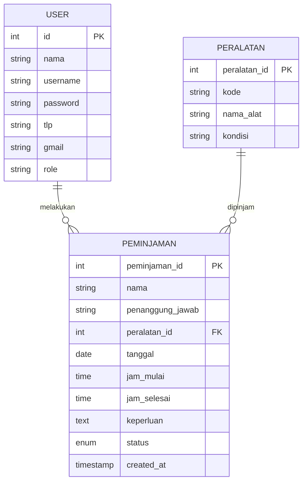

# Entity Relationship Diagram (ERD) - Sistem Peminjaman Alat

Berikut adalah diagram ERD yang menjelaskan struktur tabel dan atribut dalam database `bth_pinjam`:

### Penjelasan Entitas:

1. **USER:**

   * `id`: Primary Key (ID unik user).
   * `nama`: Nama pengguna atau organisasi.
   * `username`: Nama unik untuk login.
   * `password`: Kata sandi pengguna.
   * `tlp`: Nomor telepon pengguna.
   * `gmail`: Alamat email pengguna.
   * `role`: Hak akses pengguna (admin/pengguna).

2. **PERALATAN:**

   * `peralatan_id`: Primary Key (ID unik peralatan).
   * `kode`: Kode identitas alat.
   * `nama_alat`: Nama peralatan.
   * `kondisi`: Kondisi alat.

3. **PEMINJAMAN:**

   * `peminjaman_id`: Primary Key (ID transaksi peminjaman).
   * `nama`: Nama peminjam.
   * `penanggung_jawab`: Orang yang bertanggung jawab.
   * `peralatan_id`: Foreign Key dari tabel PERALATAN.
   * `tanggal`: Tanggal peminjaman.
   * `jam_mulai`: Waktu mulai peminjaman.
   * `jam_selesai`: Waktu selesai peminjaman.
   * `keperluan`: Tujuan peminjaman.
   * `status`: Status peminjaman (menunggu, diterima, ditolak).
   * `created_at`: Waktu data dibuat.

### Hubungan (Relationship):

Dalam sistem ini, hubungan antar tabel bersifat sebagai berikut:

* Satu **User** dapat melakukan banyak (**Many**) transaksi **Peminjaman**.
* Satu **Peralatan** dapat digunakan dalam banyak (**Many**) transaksi **Peminjaman**.
* Sistem ini menghubungkan data pengguna, peralatan, dan transaksi untuk mengelola proses peminjaman secara terstruktur.
